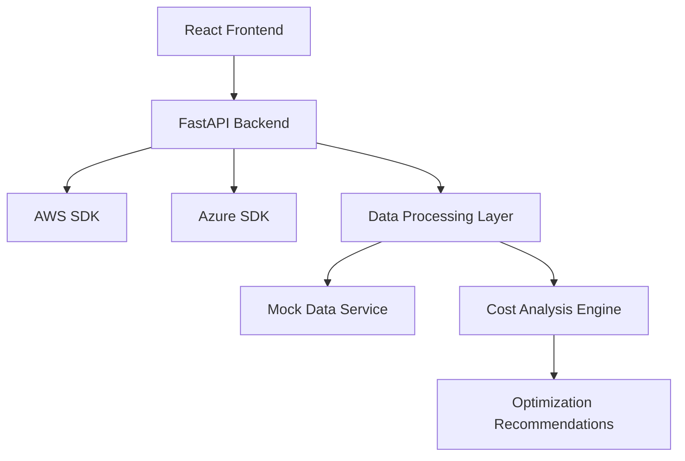

# Design Document

## Overview

The Cloud Cost Optimization Dashboard is a modern web application built with React and Vite that provides comprehensive cost analysis and optimization insights for multi-cloud environments. The application serves three primary user personas: cloud platform administrators (technical users), CFOs (financial decision makers), and Chief Data Officers (data-driven executives). The design emphasizes functionality over aesthetics, with a modular architecture that supports easy expansion and maintenance.

## Architecture

### Frontend Architecture
- **Framework**: React 18 with Vite for fast development and optimized builds
- **Styling**: Tailwind CSS for utility-first styling and responsive design
- **State Management**: React Context API for global state, local state for component-specific data
- **Routing**: React Router for navigation between different dashboard views
- **Charts**: Recharts library for data visualizations
- **Icons**: Lucide React for consistent iconography

### Backend Architecture
- **API Framework**: Python FastAPI for high-performance REST API
- **Data Processing**: Pandas for data manipulation and analysis
- **Cloud SDKs**: AWS SDK (boto3) and Azure SDK for Python for cloud platform integration
- **Database**: PostgreSQL for persistent data storage (future implementation)
- **Caching**: Redis for API response caching (future implementation)

### System Architecture Pattern


## Components and Interfaces

### Frontend Components

#### 1. Layout Components
- **AppLayout**: Main application wrapper with navigation and header
- **Sidebar**: Navigation menu with role-based sections
- **Header**: Application title, user info, and global controls
- **Dashboard**: Main content area with grid layout for widgets

#### 2. Dashboard Widgets
- **CostSummaryCard**: High-level cost overview with key metrics
- **ResourceUsageChart**: Time-series visualization of resource utilization
- **PlatformComparisonChart**: Side-by-side AWS vs Azure cost comparison
- **OptimizationRecommendations**: List of actionable cost-saving suggestions
- **ResourceInventoryTable**: Detailed table of cloud resources with costs
- **TrendAnalysisChart**: Historical cost trends and projections

#### 3. User Role Components
- **AdminDashboard**: Technical view with detailed resource metrics
- **ExecutiveDashboard**: Business-focused view with high-level insights
- **RoleSelector**: Component to switch between user perspectives

#### 4. Utility Components
- **LoadingSpinner**: Consistent loading states
- **ErrorBoundary**: Error handling and user feedback
- **Tooltip**: Contextual help and metric explanations
- **FilterPanel**: Date range, platform, and resource type filters

### Backend API Interfaces

#### 1. Cost Data Endpoints
```python
GET /api/v1/costs/summary
GET /api/v1/costs/by-platform/{platform}
GET /api/v1/costs/trends
GET /api/v1/costs/by-resource-type
```

#### 2. Resource Data Endpoints
```python
GET /api/v1/resources/inventory
GET /api/v1/resources/utilization
GET /api/v1/resources/by-platform/{platform}
```

#### 3. Optimization Endpoints
```python
GET /api/v1/optimization/recommendations
GET /api/v1/optimization/savings-potential
```

## Data Models

### Frontend Data Models

#### Cost Data Model
```typescript
interface CostData {
  id: string;
  platform: 'aws' | 'azure';
  resourceType: string;
  resourceName: string;
  cost: number;
  currency: string;
  period: DateRange;
  tags: Record<string, string>;
}

interface CostSummary {
  totalCost: number;
  monthlyTrend: number;
  topCostDrivers: CostData[];
  platformBreakdown: PlatformCosts;
}
```

#### Resource Data Model
```typescript
interface CloudResource {
  id: string;
  name: string;
  type: string;
  platform: 'aws' | 'azure';
  region: string;
  status: 'running' | 'stopped' | 'terminated';
  utilization: number;
  cost: number;
  lastUpdated: Date;
}
```

#### Optimization Data Model
```typescript
interface OptimizationRecommendation {
  id: string;
  type: 'rightsizing' | 'scheduling' | 'reserved-instances' | 'storage-optimization';
  title: string;
  description: string;
  potentialSavings: number;
  effort: 'low' | 'medium' | 'high';
  resources: string[];
  priority: number;
}
```

### Backend Data Models

#### Mock Data Structure
```python
class MockCostData:
    def __init__(self):
        self.aws_costs = self._generate_aws_mock_data()
        self.azure_costs = self._generate_azure_mock_data()
    
    def get_cost_summary(self) -> dict
    def get_platform_costs(self, platform: str) -> dict
    def get_optimization_recommendations(self) -> list
```

## Error Handling

### Frontend Error Handling
- **Error Boundaries**: Catch and display component-level errors gracefully
- **API Error Handling**: Consistent error messages for failed API calls
- **Fallback UI**: Show meaningful fallbacks when data is unavailable
- **User Feedback**: Toast notifications for user actions and errors

### Backend Error Handling
- **HTTP Status Codes**: Proper REST API status codes for different scenarios
- **Error Response Format**: Consistent error response structure
- **Logging**: Comprehensive logging for debugging and monitoring
- **Validation**: Input validation with clear error messages

### Error Response Format
```json
{
  "error": {
    "code": "INVALID_PLATFORM",
    "message": "Platform must be either 'aws' or 'azure'",
    "details": {
      "field": "platform",
      "provided_value": "gcp"
    }
  }
}
```

## Testing Strategy

### Frontend Testing
- **Unit Tests**: Jest and React Testing Library for component testing
- **Integration Tests**: Test component interactions and data flow
- **Visual Testing**: Storybook for component documentation and visual regression
- **E2E Tests**: Playwright for full user journey testing

### Backend Testing
- **Unit Tests**: pytest for individual function testing
- **API Tests**: FastAPI TestClient for endpoint testing
- **Mock Data Tests**: Validate mock data generation and consistency
- **Integration Tests**: Test API integration with frontend

### Test Data Strategy
- **Mock Data Generation**: Realistic but synthetic cloud cost data
- **Test Scenarios**: Cover different user roles and use cases
- **Edge Cases**: Test with empty data, large datasets, and error conditions

### Testing Structure
```
tests/
├── frontend/
│   ├── components/
│   ├── integration/
│   └── e2e/
├── backend/
│   ├── unit/
│   ├── api/
│   └── integration/
└── fixtures/
    ├── mock-data/
    └── test-scenarios/
```

## Implementation Considerations

### Performance Optimization
- **Code Splitting**: Lazy load dashboard components
- **Data Virtualization**: Handle large datasets efficiently
- **Caching**: Cache API responses and computed data
- **Debounced Filtering**: Optimize real-time filtering performance

### Accessibility
- **WCAG Compliance**: Follow accessibility guidelines
- **Keyboard Navigation**: Full keyboard accessibility
- **Screen Reader Support**: Proper ARIA labels and descriptions
- **Color Contrast**: Ensure sufficient contrast for all users

### Responsive Design
- **Mobile-First**: Design for mobile devices first
- **Breakpoint Strategy**: Tailwind CSS responsive utilities
- **Touch-Friendly**: Appropriate touch targets for mobile users
- **Progressive Enhancement**: Core functionality works on all devices

### Security Considerations
- **API Security**: Implement proper authentication and authorization
- **Data Sanitization**: Sanitize all user inputs
- **CORS Configuration**: Proper cross-origin resource sharing setup
- **Environment Variables**: Secure configuration management